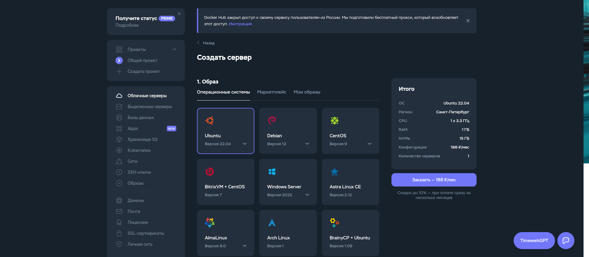
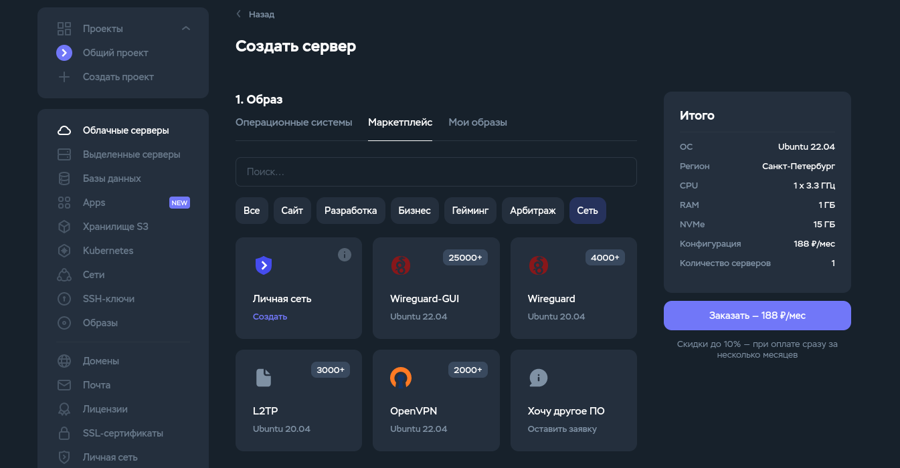
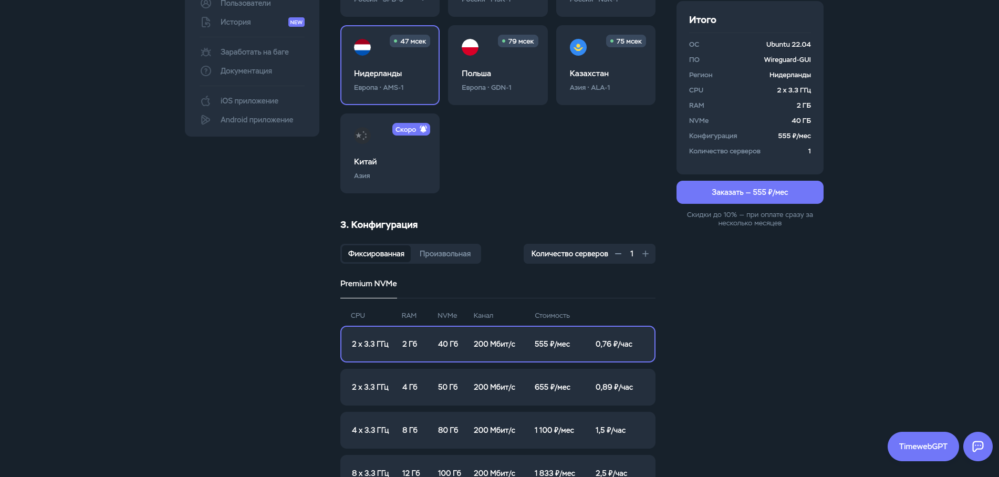
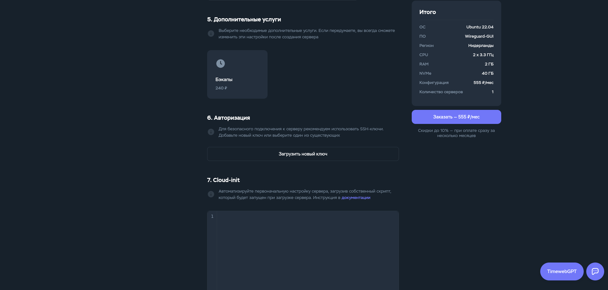
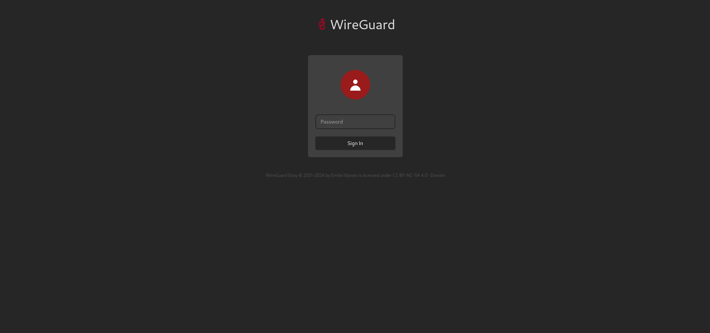
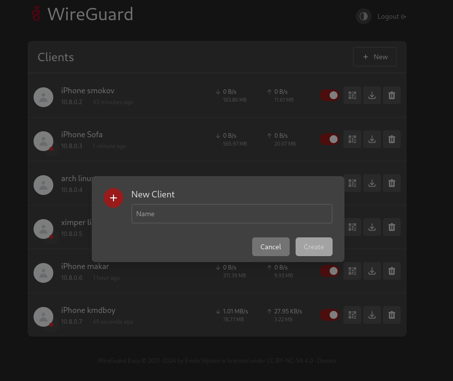
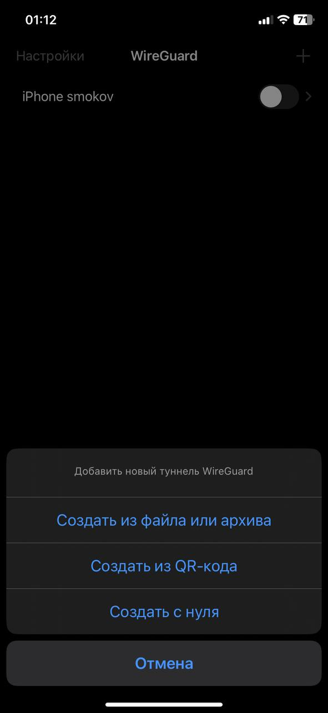
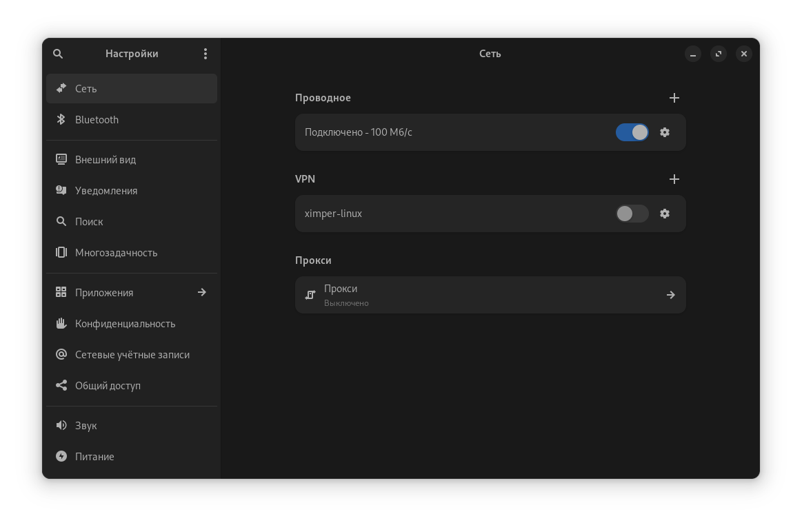

<h1>Создание Wireguard VPN сервера на Timeweb</h1>

Этот репозиторий содержит инструкцию по развертыванию VPN сервера на платформе Timeweb 
 

## :blue_book: Что нужно:

   - Аккаунт на Timeweb.
   - Прямые руки и 5 минут времени

## 🚀 Создание и настройка сервера на Timeweb
  
  1. Войдите в свой аккаунт Timeweb.
           
   

  

   
  
  2. Создайте новый сервер (Облачные серверы-Маркетплейсы-Сеть-Wireguard-GUI).

   
 
  
 
  
 
  3. Регион выбирать с наилучшим пингом (Я выбрал Нидерланды)

   

  

  
   

  
  4. Дальше можете добавить SSH ключи, конфигурацию выбрал минимальную, доп.услуги отключить

    

   
  
  5. После оплаты и создания сервера, вам на почту придет ip сервера и пароль
  6. Заходим в веб интерфейс Wireguard
  
    

   

  7. Останется только добавить клиентов (Под каждое устройство новый клиент)

   

  

   
  
  8. Для того чтобы подключиться с телефона нужно приложение Wireguard, а дальше сканируете QR-Код и подключаетесь

   

  

  
  

  9. На Windows есть приложение, а на linux подключение будет отличаться в зависимости от дистрибутива
 
   

  

  
  
  
